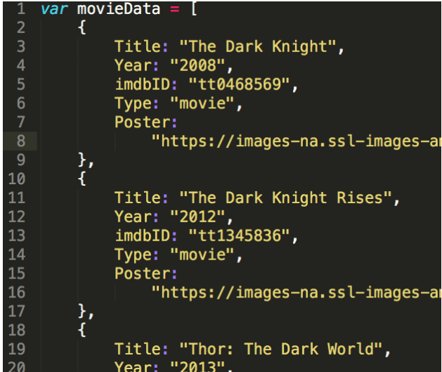

# Scene It App

### Part 1: Rendering Movies and Search

## Objective

Now that we've got a good general understanding of how we can render data to the
DOM, we're going to take a stab at building a practical application, worthy of a
spot in our portfolios! The app is called Scene It, and it's a simple tool for
searching for movies, flagging ones you want to watch, and later giving them a
thumbs up or thumbs down after you watch them. The finished product will use
Axios to make requests to an external API called OMDB, but we'll handle that in
part 2!

## Your Task:

Your task is to build a UI that "consumes" the data that comes from the OMDB
API. When you fork the starter repository called scene-it-starter, you'll see
something like this:

When you're done, you'll have something that looks like this:

Since we're not actually using the OMDB API until part 2, for now there's a file
called data.js that contains some movie data. The search bar will "work", but it
will always show the list of movies in data.js, no matter what you enter into
the search bar.

## Let's do it!
### Step 1 - Design the HTML
Before we get to writing some javascript, we might as well tackle the HTML and
CSS required. In the screenshot above, you can see that movies show up as
Bootstrap Cards ( https://getbootstrap.com/docs/4.1/components/card/ ) . You can
try to code something that looks exactly like the screenshot, but I think adding
your own spin to it might be better! For example, instead of using Bootstrap
Cards, you could have the search results show up as rows in a table, much like
the Skware Cash example. It's up to you! No matter how you design your app, the
general process is the same:

1. In index.html, find the comment that says _MOVIES SHOW UP HERE!_
1. Add a
`
` tag with the class "movies-container". This div will contain all the
individual movie renderings.
1. Inside the "movies-container" div you just
created, add another `
` tag with the class "movie". This div will represent
a single movie
1. Flush out your movie div: - Your movie div should contain an
`<image />` tag somewhere for the movie poster
   - Include a tag for the movie title
   - Include a tag for the movie release date
   - Include an "add" button somewhere
1. Style your movie `
` and its children with CSS - If you end up using
Bootstrap cards, you might not have to do any CSS! 6. Once you're satisfied with
your movie `
`, copy and paste it a couple of times to see what it looks
like 7. Style your "movie" `
` and the "movies-container" `
` to make
sure there's enough padding, margin, etc. between movies. (or you can use
flex-box if you want!)

### Step 2 - Render movies

Now that you have the appropriate HTML and CSS, you can write a `renderMovies()`
function that will generate the right HTML based off the data in _data.js._

When you're done with this step, you'll have a function that will take in an
**array of movie objects** and return **a string of HTML** that looks like the
HTML you wrote in step 1

1. In index.js start off by writing a "document ready" block -
document.addEventListener('DOMContentLoaded', function() { });
1. Inside the
"document ready" block, define a function called `renderMovies`
1. Make the
function take one parameter called `movieArray`
1. Write a `.map()` loop on the
`movieArray` parameter - Remember that `.map()` takes an anonymous function as a
parameter - This anonymous function should have one parameter, you can call it
`currentMovie` - Take the result of this `.map()` and save it to a variable
called `movieHTML`
1. Take a step back! Let's look at the data in _data.js:_

- Notice that this array contains many objects The `movieData` variable will be
  passed in as `movieArray` in the `renderMovies` function we're currently
  writing That means the `currentMovie` will be just one of these objects If
  we want to access a movie's title, for instance, you'd use
  `currentMovie.Title`

1. Knowing this, use [template
literals](https://developer.mozilla.org/en-US/docs/Web/JavaScript/Reference/Template_literals)
(example: `` `example` ``) on `currentMovie` to start
building out your movie HTML. 7. At the very end, make sure to `return
finalHTML.join('')` - This return statement should be after the map() loop,
not inside of it 8. Test that your render function works!

   - Somewhere in your document ready block, set the innerHTML of
   - movie-container to `renderMovies(movieData)`

Nice! You should see a bunch of movies show in your DOM.

### Step 3 - Make movies show up whenever you use the search bar

Now that we know we can get movies to show up on screen, we can control exactly
when that happens. Remember, we're building a movie search tool! We only want
movies to show up when you search for them.

1. Delete your code from part 8 of Step 2
1. Replace it with a form submit
listener: - document.getElementById('myForm').addEventListener('submit',
function(e){})
1. You'll notice that if you try to do a search right now, the
page refreshes! We can stop that with `preventDefault` - Make sure the
anonymous function in the submit listener has one parameter called `e` - The
first line in the anonymous function should be `e.preventDefault`
1. Finally rewrite the code that shows the movies to the screen

And that's it! Now, when you refresh the page there won't be any movies. Only
when you search for something will you see the movies.

In part 2, we'll tackle those "add" buttons. When you click on the buttons, the
movie id will be saved to LocalStorage and rendered to your "watchlist"
