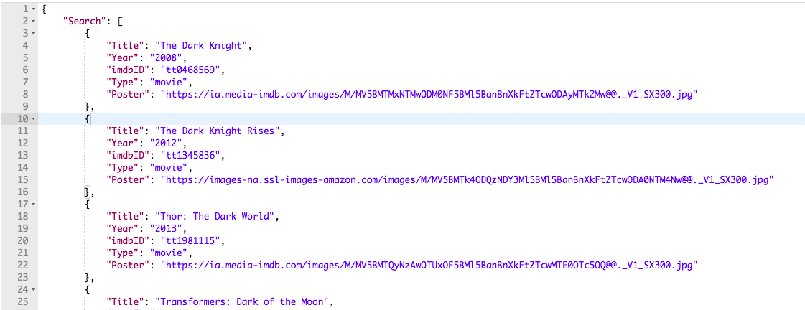

# Scene It App
####  Part 3: Querying the OMDB API

## Your task:
Once you've finished Part 2, your Scene It app should allow the
user to save movies to their "watch list". Now that the core of your front end
application is finished, your task for part 3 is to hook up your front end to
the OMDB API back end!

When you're done, you'll be able to delete data.js - instead of pulling in that
hard coded data, we'll be pulling in search data from omdbapi.com!

## Let's do it!
### Step 1 - Look at the code we're going to refactor
Take a look at the callback function inside of your search form submit listener.
So far, this code just renders the movie data array in data.js, saves the
resulting HTML string to `movieHTML`, and then uses innerHTML to insert that
HTML into the DOM (specifically, inside the `<div>` with
`class="movies-container"`). Instead of passing `movieData` into
`renderMovies()`, we're going to pull a similar array from the OMDB API and pass
that through `renderMovies()`.

### Step 2- Get the search string from the \<input\> tag

We know that the submit listener's callback will trigger whenever the user
submits a search string in the search bar. We might as well grab the string they
typed and save it to a variable!

1. Create some empty space right after `e.preventDefault()`
1. In that space, use jQuery to select the search bar and save its content to a variable called `searchString`
1. You should end up with a line like this:
  ```js
  let searchString = document.getElementById('search-bar').value
  ```

We need this `searchString` variable because we'll be passing it to the OMDB API
in the querystring. The URL we'll be targeting is:

```
http://www.omdbapi.com/?apikey=3430a78&s=SearchStringGoesHere
```

Our goal is to inject the contents of the `searchString` variable right after
the `&s=` part of the URL. For example if the user inputs "Fun", the URL we'll
target is:

```
http://www.omdbapi.com/?apikey=3430a78&s=Fun
```

But what if the user includes spaces in the URL? Like with "Fun with"?

```
http://www.omdbapi.com/?apikey=3430a78&s=Fun With
```

Last time I checked, URLs aren't allowed to have spaces in them! Thankfully, we
can "sanitize" the user's input with a handy built-in function called
`encodeURIComponent()`. If we use this function on `searchString`, we'll end up
with a URL-friendly search string like this:

```
http://www.omdbapi.com/?apikey=3430a78&s=Fun%20With
```

Notice that the space got replaced with %20 in the querystring!

1. Create another variable called URLEncodedSearchString
1. Set it equal to encodeURIComponent()
1. In the same line, pass in searchString as the parameter
1. You should end up with a line:
```js
var URLEncodedSearchString = encodeURIComponent(searchString);
```

### Step 3- Use ajax to query the OMDB API

Now that we know what the user wants to search for, we can use ajax to poll the
OMDB API. You can take a look at the documentation for the omdb api here:
http://www.omdbapi.com/

According to their website, you can request movies by imdbID or movie title, OR
you can search for movies using a keyword (which is exactly what we want to
do!). Notice that the only thing we need to do is provide two querystring
parameters, `apikey` (which is the super-secret password I pay $1 per month
for), and `s` (which is the keyword/s we're searching for). That's why, as I
mentioned above, the URL we want to hit is:

```
http://www.omdbapi.com/?apikey=3430a78&s=SearchStringGoesHere
```

You can use Postman to test out a search for the keyword "Dark" - you should see
a response like: (not shown in the screenshot below are the keys `totalResults`
and `Response`.



Notice that the array under the key "Search" looks exactly like the hard coded
data we've been using in data.js!

Alrighty, enough dilly-dallying, let's get to it!
1. Still inside the submit callback, make a call to `axios's .get()` function
1. Pass a the URL into axios.get()
```js
 "http://www.omdbapi.com/?apikey=3430a78&s=" + URLEncodedSearchString
 ```
1. Chain a .then() after axios.get();
1. Provide .then() with an anonymous function that has response as its parameter. Console log response.data in its body:
```js
function(response) {
	console.log(response.data);
}
```

That's all it takes to query the omdb API using jquery! (We're not done yet
though, we still need to pass the omdb results through our `renderMovies()`
function) . Now, when you submit a new search, you should see network requests
showing up in the Network tab in Chrome Developer Tools.


### Step 4- Show OMDB's movie data using renderMovies()

We're at the finish line! If you haven't deleted your old code already, you
should see two lines in your code like:

```js
var movieHTML = renderMovies(movieData);
moviesContainer.innerHTML = movieHTML;
```

1. Go ahead and copy these two lines to your clipboard and then delete them.
1. Paste them into the .then() callback function
1. Replace movieData with response.data.Search
  - Remember, when we tried the OMDB query in Postman, the movie data was contained under the "Search" key.
  - The parameter response contains the data that came back from the OMDB API

That's it! Now you should be able to search for whatever movies you want!


## That's it! What's next?

Dang, that's a pretty spiffy application you've got there! It's definitely
something to be proud of! First things first, let's make sure your code on
github is up to par. You should probably:

1. Delete any scratch code
1. Remove any unhelpful console.log()s or comments
1. Make sure the version you push up to github is in working order
1. Deploy your application to surge, netlify, or github pages
1. If you have a portfolio website, include a link to your Scene It app

With those logistics out of the way, you can add whatever you want to Scene It!
Here are some ideas:

- Redesign the application to your own aesthetic
- Some movies that come back from the API don't have image URLs. Maybe add a default "no image found" image for those movies!
- Allow users to rate and/or review movies that are on their watchlist
- Let users click on movies to show more details about the movie (rotten tomatoes rating, synopsis, etc.)
