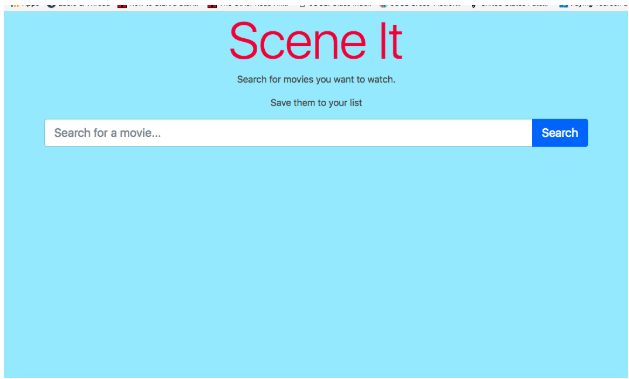
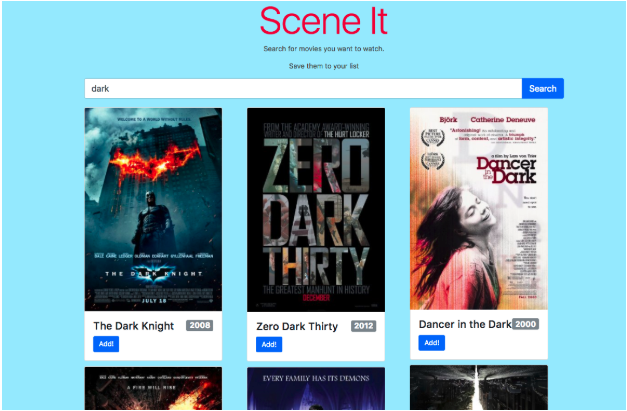

# Scene It Part 1: Rendering Movies and Search

## Overview

Now that we've got a good understanding of how we can render data to the DOM,
we're going to take a stab at building a practical application, worthy of a spot
in our portfolios! The app is called Scene It, and it's a simple tool for
searching for movies, flagging ones you want to watch, and later giving them a
thumbs up or thumbs down after you watch them. The finished product will use
AJAX to request data from [The Open Movie Database] (OMDB), but for now let's
build against some local data.

[The Open Movie Database]:https://www.omdbapi.com/

## Your Task

Your task is to build a UI that "consumes" the data that comes from the OMDB
API. In the `code/` folder of this repo there is an `index.html` file that looks
like this:



When we are finished, the final product will look something like this:



Since we are not connecting to the OMDB API until Part 3, for now there's a file
called `js/movies-mock-data.js` that contains some movie data. The search bar
will "work", but it will always show the list of movies in `js/movies-mock-data.js`,
no matter what you enter into the search bar.

It is a common practice in web development to build HTML and CSS with local mock
data that mirrors the structure of the "real" data that will come from an API.
The HTML and CSS will be the same either way, but it is easier and faster to use
files on disk than AJAX requests to get started and prototype your design.

## Step 1 - Design the HTML

Before we get to writing some JavaScript, we need to tackle the HTML
and CSS required. In the screenshot above, you can see that movies show up as
[Bootstrap Cards]. You can try to code something that looks exactly like the
screenshot, but I think adding your own spin to it might be better. For example,
instead of using Bootstrap Cards, you could have the search results show up as
rows in a table, much like the Skware Cash example. It's up to you! No matter
how you design your app, the general process is the same:

1. In `index.html`, find the comment that says `TODO: movies will show up here`
1. Replace that comment line with a `div` element that has an id of
   `moviesContainer` (`<div id="moviesContainer"></div>`). This div will contain
   all the individual movie renderings.
1. Inside the `"moviesContainer"` div you just created, add another `div`
   element with class `"movie"` (ie: `<div class="movie"></div>`). This div will
   represent a single movie.
1. Flush out your `<div class="movie">`:
  - Include an `<image />` element somewhere for the movie poster
  - Include an element for the movie title
  - Include an element for the movie release date
  - Include an "add" button somewhere
  - Remember to pick semantically meaningful tags for these HTML elements
1. Style your `<div class="movie">` and its children with CSS. If you end up
   using Bootstrap cards, you may not need to write much custom CSS!
1. Once you're satisfied with your `<div class="movie">`, copy and paste it a
   couple of times to see what it looks like when there are more than one of
   them on the page.
1. Style your `<div class="movie">` and `<div id="moviesContainer">` to make
   sure there's enough padding, margin, etc. between movies. (or you can use
   flex-box if you want!)

[Bootstrap Cards]:https://getbootstrap.com/docs/4.1/components/card/

## Step 2 - Render movies

Now that you have the appropriate HTML and CSS, you can write a `renderMovies()`
function that will generate the right HTML based off the data in `js/data.js`

When you're done with this step, you'll have a function that will take in an
**array of movie objects** and return **a string of HTML** that looks like the
HTML you wrote in step 1.

1. In `index.js`, start off by writing a "document ready" block:
  ```js
  document.addEventListener('DOMContentLoaded', function() { });
  ```
1. Inside the "document ready" block, define a function called `renderMovies`
1. Make the function take one parameter called `movieArray`
1. Write a `.map()` loop on the `movieArray` parameter. Remember that `.map()`
takes an function as an argument. This function should have one parameter, you
can call it `currentMovie`. Take the result of this `.map()` and save it to a
variable called `movieHTML`
1. Take a step back! Let's look at the data in `js/data.js`:
  
1. Notice that this array contains many objects The `movieData` variable will be
  passed in as `movieArray` in the `renderMovies` function we're currently
  writing That means the `currentMovie` will be just one of these objects If
  we want to access a movie's title, for instance, you'd use
  `currentMovie.Title`

1. Knowing this, use [template literals] (example: `` `example` ``) on `currentMovie` to start
building out your movie HTML. 7. At the very end, make sure to `return
finalHTML.join('')` - This return statement should be after the map() loop,
not inside of it

8. Test that your render function works:
   - Somewhere in your document ready block, set the innerHTML of
   - movie-container to `renderMovies(movieData)`

Nice! You should see a bunch of movies show in your DOM.

[template literals]:https://developer.mozilla.org/en-US/docs/Web/JavaScript/Reference/Template_literals

## Step 3 - Make movies show up whenever you use the search bar

Now that we know we can get movies to show up on screen, we can control exactly
when that happens. Remember, we're building a movie search tool! We only want
movies to show up when you search for them.

1. Delete your code from part 8 of Step 2
1. Replace it with a form submit listener:
  ```js
  document.getElementById('myForm').addEventListener('submit', function(evt) {
    //...
  })
  ```
1. You'll notice that if you try to do a search right now, the page refreshes.
We can stop that with the built-in `preventDefault` function. Make sure the
anonymous function in the submit listener has one parameter called `evt` - The
first line in the anonymous function should be `evt.preventDefault()`
1. Finally rewrite the code that shows the movies to the screen

## Part 1 Wrap-up

And that's it! Now, when you refresh the page there won't be any movies. Only
when you search for something will you see the movies.

In [Part 2], we'll tackle those "add" buttons. When you click on the buttons, the
movie id will be saved to `localStorage` and rendered to your "watchlist"

[Part 2]:part2.md
